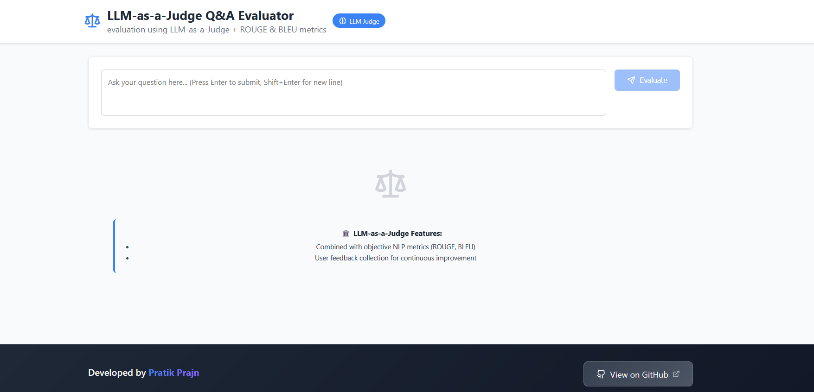
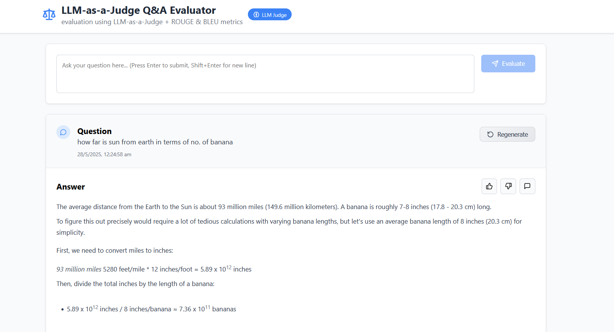
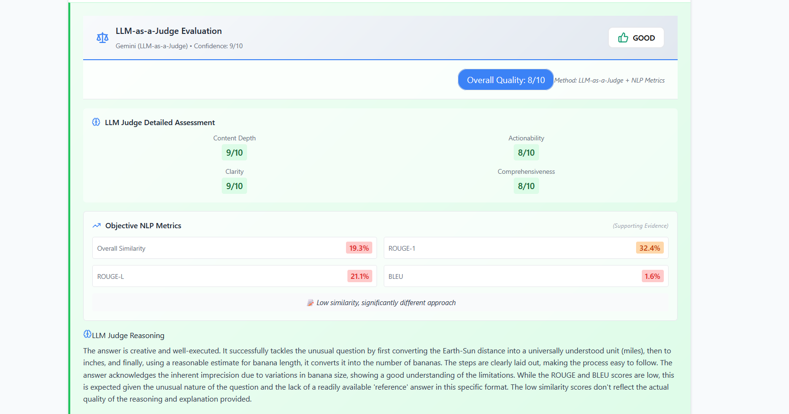
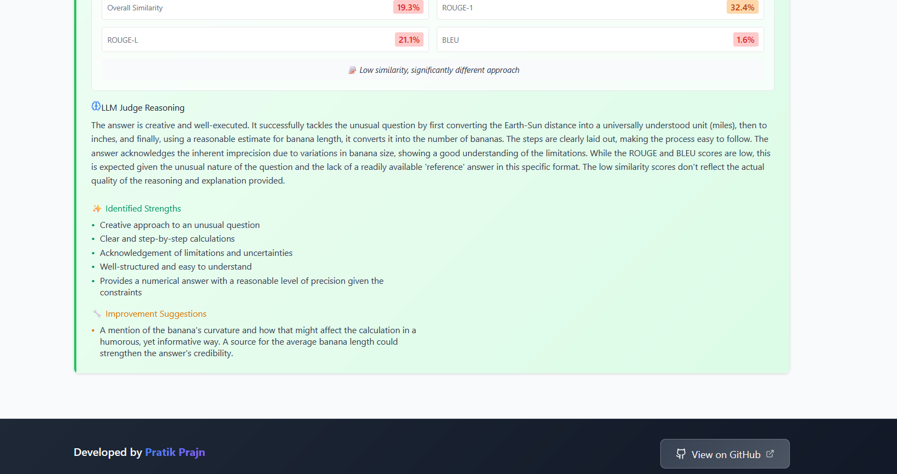

# LLM-as-a-Judge Q&A Evaluator

Try it out: 👉 [qa-evaluator-ui.vercel.app](https://qa-evaluator-ui.vercel.app)


---

## 🛠️ Tech Stack

- **Backend:** Python 3, Flask, huggingface_hub, pandas, datasets  
- **Frontend:** React.js, CSS (with animations)  
- **Deployment:** Railway (Procfile, railway.toml)  

---

## 📷 UI Preview










#⚡ Features

    LLM-based open-ended QA evaluation

    Integration with human feedback and automated metrics

    Production-ready React frontend with smooth UI

    Flask backend with health checks and CORS enabled

    Ready for cloud deployment with Railway
## Setup

1. Clone the repository
2. Install dependencies: `pip install -r requirements.txt`
3. Create `.env` file with your API key:
   ```
   GEMINI_API_KEY=your_api_key_here
   ```
4. Run the backend: `python api_server.py`
5. Run the frontend: `cd qa-evaluator-ui && npm start`

## Environment Variables

- `GEMINI_API_KEY`: Your Google Gemini API key (required)
- `PORT`: Server port (default: 5000)
- `FLASK_ENV`: Environment (development/production)

## Deployment

Set the `GEMINI_API_KEY` environment variable on your hosting platform.
